# Cloudflare Tunnel ile Local Ortamı Güvenle Paylaşmak

Yerel geliştirme ortamını başka bir cihazdan açmak, ekip içinde göstermek veya geçici bir demo paylaşmak ilk bakışta oldukça basit bir ihtiyaçtır.

Uygulama yerel makinede çalışır:

```txt
http://localhost:3000
```

Tenant tabanlı bir yapıda ise aşağıdaki gibi adresler kullanılabilir:

```txt
https://lvh.me
https://demo.lvh.me
```

İstenen şey basit:

> Yerelde çalışan uygulamayı internetten erişilebilir hâle getirmek.

Fakat konuya HTTPS, subdomain routing, NAT, firewall, DNS ve erişim kontrolü girince iş hızla büyüyebilir. Bu rehber, problemi **Cloudflare Tunnel** ve **Cloudflare Access** kullanarak çözen bir yapı sunar.

Ortaya çıkan yapı kabaca şöyle:

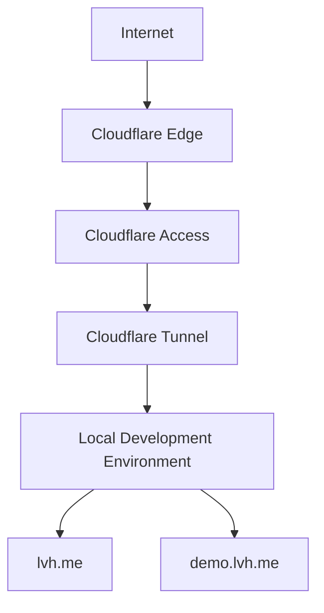

Bunun en güzel yanı, router üzerinde port açmadan, public IP ile uğraşmadan ve yerel makineyi doğrudan internete maruz bırakmadan çalışmasıdır.

---

## Problem

Geliştirdiğim uygulamada tenant bazlı subdomain routing bulunuyor. Yerel geliştirme ortamındaki adresler şöyle:

```txt
lvh.me
demo.lvh.me
acme.lvh.me
```

`lvh.me`, doğrudan `127.0.0.1` adresine resolve olduğu için subdomain tabanlı uygulamaları yerelde test etmek için oldukça kullanışlıdır.

Örneğin:

```txt
https://demo.lvh.me/dashboard
```

Bu istek uygulamaya geldiğinde hostname üzerinden `demo` tenant'ı belirlenebilir.

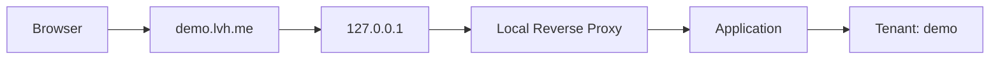

Problem, aynı ortamın internetten erişilebilir olması gerektiğinde başlar. `demo.lvh.me` yalnızca yerel makinede anlamlıdır. Başka bir cihazdan erişim için klasik çözüm şunları gerektirebilir:

- Port forwarding
- Firewall kuralları
- Public IP
- Dynamic DNS
- Reverse proxy
- TLS sertifikası
- Authentication

Yalnızca bir development ortamını paylaşmak için gereğinden fazla altyapı.

---

## İlk Deneme: Cloudflare Quick Tunnel

Cloudflare'ın `cloudflared` aracıyla yerel bir uygulamayı birkaç saniye içinde internete açmak mümkündür:

```powershell
cloudflared tunnel --url https://lvh.me
```

Cloudflare otomatik olarak şu tarz bir adres verir:

```txt
https://random-name.trycloudflare.com
```

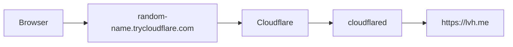

Basit bir landing page veya API paylaşmak için bu yaklaşım oldukça kullanışlıdır ve herhangi bir domain ayarlamak gerekmez. Fakat multi-tenant uygulamalarda bir sınıra takılır.

Uygulama tenant URL'sini şöyle üretmek isterse:

```txt
demo.random-name.trycloudflare.com
```

bu hostname DNS üzerinde bulunmaz. Quick Tunnel yalnızca oluşturduğu hostname'i sağlar; altında otomatik wildcard DNS oluşturmaz.

```txt
random-name.trycloudflare.com        ✅
demo.random-name.trycloudflare.com   ❌
```

Bu nedenle multi-tenant development ortamı için **Named Tunnel** daha uygun bir seçenektir.

---

## Named Tunnel

Cloudflare Dashboard üzerinden kalıcı bir tunnel oluşturmak mümkündür. Bu örnekte `dev` isminde bir tunnel kullanılır. Tunnel'a ait `cloudflared` connector yerel bilgisayarda çalışır ve Cloudflare bağlantısını başlatır.

Buradaki önemli mimari fark şudur:

> Cloudflare yerel bilgisayara inbound bağlantı kurmaz; yerel bilgisayar Cloudflare'a outbound bağlantı kurar.

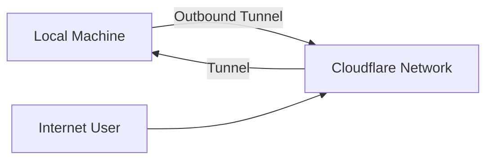

Bu nedenle:

- Router üzerinde port forwarding gerekmez.
- Public IP gerekmez.
- Yerel firewall üzerinde internetten gelen inbound port açılmaz.

Network modeli klasik port forwarding yaklaşımından farklıdır:

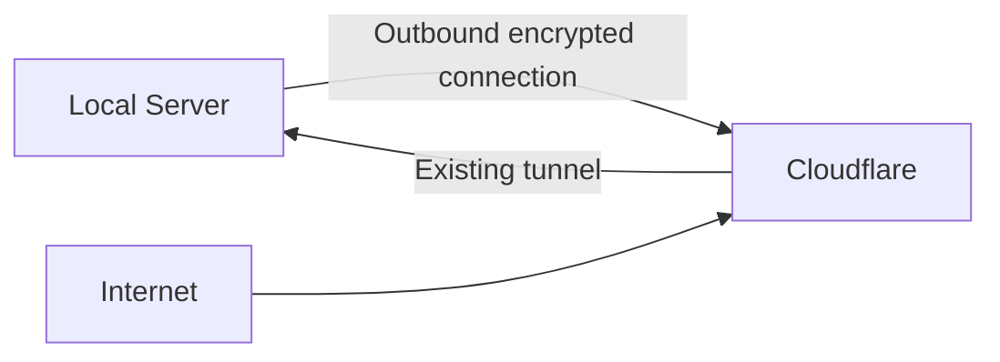

---

## Custom Domain'i Yerel Uygulamaya Bağlamak

Tunnel oluşturulduktan sonra örnek domain üzerinde bir hostname tanımlanır:

```txt
dev.acme.com
```

Route şu şekilde çalışır:

```txt
dev.acme.com
      ↓
https://lvh.me
```

Bundan sonra `https://dev.acme.com` adresine gelen istek yerel geliştirme ortamına ulaşır.

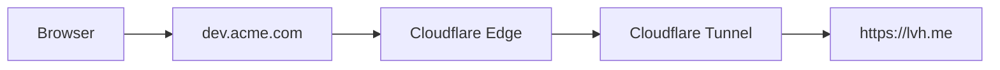

Public HTTPS sertifikasını Cloudflare yönetir. Yerel uygulamanın public internet için ayrıca TLS sertifikası yönetmesi gerekmez.

---

## Local HTTPS ve 502 Problemi

Örnek development ortamı zaten HTTPS kullanır:

```txt
https://lvh.me
```

Tarayıcı yerel development sertifikasına güvense bile `cloudflared` aynı sertifikayı doğrulayamayabilir. Bunun sonucu `502 Bad Gateway` olabilir.

Development ortamı için Tunnel route ayarlarında şu seçenek etkinleştirilebilir:

```txt
Disable TLS certificate verification
```

Böylece Cloudflare Tunnel, yerel origin'in sertifikasını doğrulamadan bağlantı kurar.

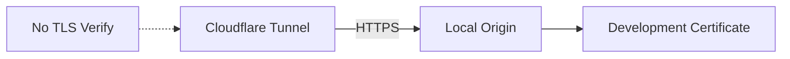

Bu ayar yalnızca kontrollü bir development ortamı için düşünülmelidir. Production ortamında doğru çözüm, geçerli bir origin certificate kullanmaktır.

---

## Host Header Sorunu

Bu senaryodaki en kritik noktalardan biri `Host` header'dır. Public request `https://dev.acme.com` üzerinden gelirken yerel uygulama `lvh.me` hostname'ini bekler.

Cloudflare request'i olduğu gibi origin'e gönderirse uygulama şu header'ı görebilir:

```http
Host: dev.acme.com
```

Ancak yerel reverse proxy şunu bekliyorsa routing başarısız olabilir:

```http
Host: lvh.me
```

Cloudflare Tunnel, `HTTP Host Header` değerini override etmeye izin verir. Route'u şu şekilde ayarladım:

```txt
Public Hostname:
dev.acme.com

Service URL:
https://lvh.me

HTTP Host Header:
lvh.me
```

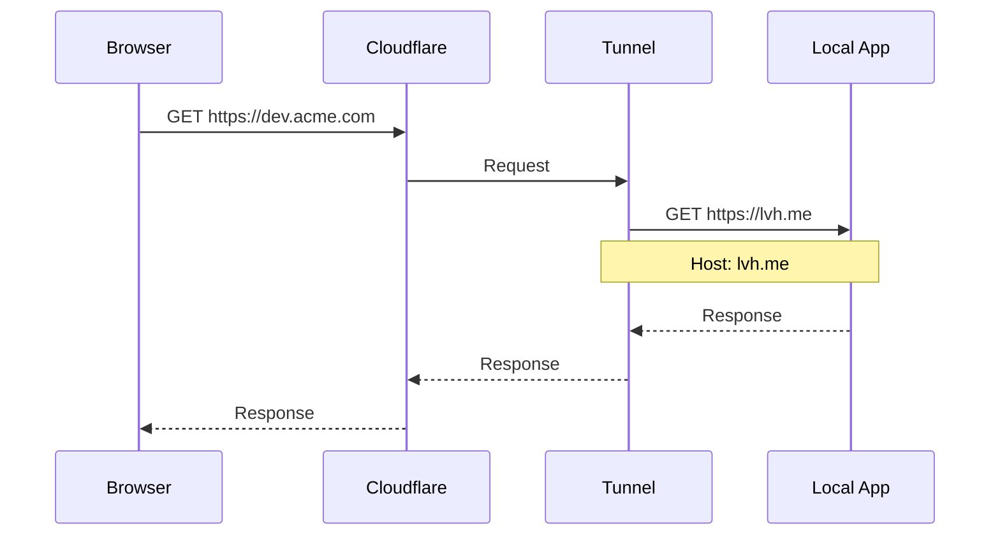

Böylece dışarıdaki hostname ile yerel development hostname'i birbirinden ayrılabilir.

---

## Tenant Routing

Uygulamada örnek olarak `demo` tenant'ı bulunuyor.

Yerel adres:

```txt
https://demo.lvh.me
```

Public development adresi için ayrı bir route tanımlanır:

```txt
demo-tenant.acme.com
```

Route ve origin ayarları:

```txt
Public Hostname:
demo-tenant.acme.com

Service URL:
https://demo.lvh.me

HTTP Host Header:
demo.lvh.me

Disable TLS certificate verification:
Enabled
```

Bu sayede `https://demo-tenant.acme.com` adresine gelen request, yerelde `https://demo.lvh.me` üzerinden işlenir.

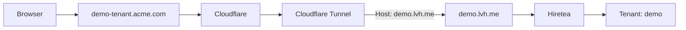

Böylece production ortamına deploy etmeden gerçek internet üzerinden tenant davranışını test etmek mümkün olur.

### Neden `demo.dev.acme.com` Yerine `demo-tenant.acme.com`?

İlk düşüncem tenant URL'lerini şöyle oluşturmaktı:

```txt
demo.dev.acme.com
tenant-a.dev.acme.com
```

Ancak bu adresler, `*.acme.com` gibi tek seviyeli bir wildcard sertifikanın kapsadığı `demo.acme.com` adresinden bir seviye daha derindedir. Sertifika kapsamını ayrıca yönetmemek için daha basit bir hostname kullanılabilir:

```txt
demo-tenant.acme.com
```

Bu senaryodaki amaç production domain mimarisini birebir taklit etmek değil, tenant davranışını internet üzerinden güvenle test edebilmektir.

---

## Tunnel Public Olunca Güvenlik Ne Oluyor?

Cloudflare Tunnel kullanmak servisi otomatik olarak private yapmaz. `https://dev.acme.com` public olarak yayınlanıyorsa URL'yi bilen biri erişebilir.

Tunnel network katmanında güvenli bağlantı sağlar; authorization ise ayrı bir problemdir:

```txt
Cloudflare Tunnel = Connectivity
Cloudflare Access = Authorization
```

---

## Cloudflare Access

Cloudflare Access, uygulamanın önüne bir identity katmanı ekler.

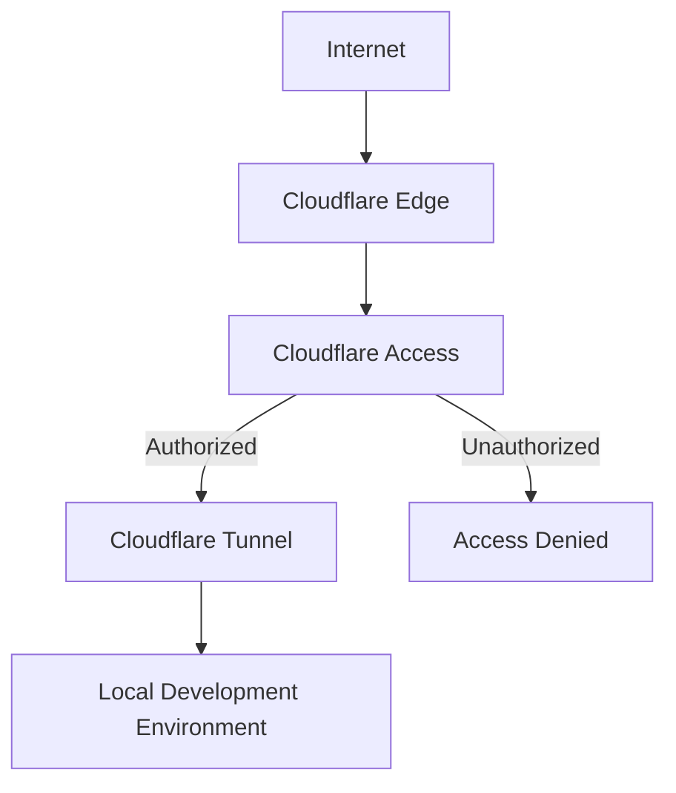

Access policy yalnızca belirli bir e-posta adresine izin verecek şekilde tanımlanabilir:

```txt
Action:
Allow

Include:
Email = developer@example.com
```

Bu yapılandırmadan sonra kullanıcı `https://dev.acme.com` adresini açtığında doğrudan development uygulamasını görmez; önce Cloudflare Access authentication ekranı gelir.

### One-Time PIN ile Authentication

Development ortamı için Google OAuth, GitHub OAuth veya başka bir Identity Provider kurulması gerekmez. Cloudflare'ın One-Time PIN yöntemi yeterli olabilir.

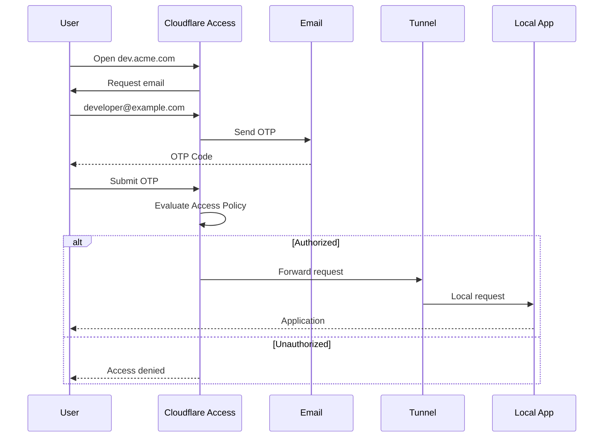

Böylece yerel development uygulaması internete bağlı olsa bile yalnızca izin verilen kullanıcılar içeri girebilir.

---

## Neden VPN Kullanmadım?

Aynı problemi Tailscale gibi bir VPN çözümüyle de çözmek mümkündür. Yalnızca yönetilen cihazlar arasında erişim gerekiyorsa VPN yaklaşımı oldukça mantıklıdır.

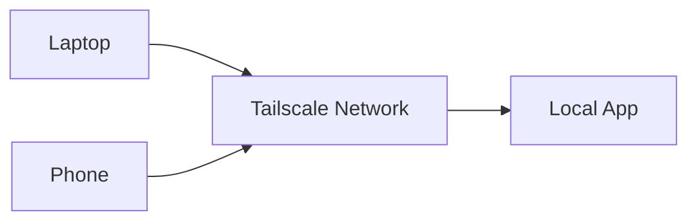

Ancak development ortamını başka birine göstermek istediğinizde karşı tarafın client kurması, ağa katılması ve VPN bağlantısı açması gerekebilir.

Cloudflare Access yaklaşımında ise yalnızca browser yeterlidir:

1. Demo bağlantısı kullanıcıyla paylaşılır.
2. Kullanıcı e-posta ile doğrulanır.
3. Uygulamaya erişim sağlanır.

Bu nedenle demo, staging ve internal web uygulamalarında oldukça kullanışlı bir yaklaşımdır.

---

## Ortaya Çıkan Mimari

Başlangıçtaki hedef yalnızca localhost'u internetten açmaktı. Ortaya çıkan sistem ise küçük bir identity-aware gateway oldu.

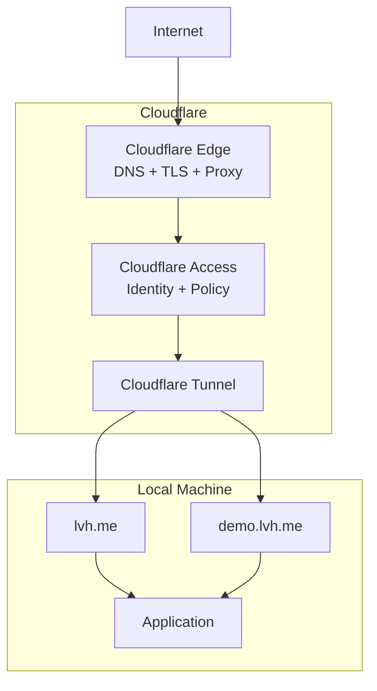

Bu yapının içinde şunlar bulunuyor:

- DNS
- TLS
- Reverse proxy
- Secure tunnel
- Host header routing
- Authentication
- Authorization

Ve bütün bunlar yerel makineye internetten doğrudan inbound port açmadan çalışıyor.

---

## Nerelerde Kullanılabilir?

Aynı yaklaşım yalnızca local development için değil, aşağıdaki gibi internal servislerde de kullanılabilir:

```txt
staging.example.com
grafana.example.com
admin.example.com
monitoring.example.com
internal-api.example.com
```

Örneğin Grafana için akış şöyle olabilir:

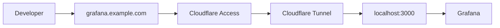

Policy ise belirli bir şirket domainine izin verecek şekilde tanımlanabilir:

```txt
Allow
Email domain = company.com
```

Uygulamanın kendi authentication sistemi olmasa bile önüne merkezi bir identity katmanı konabilir.

---

## Sonuç

Bu kurulum yerel uygulamaya şu özellikleri kazandırır:

- Custom domain ve HTTPS
- Outbound tunnel
- Tenant routing ve Host header rewriting
- Authentication ve authorization
- OTP login
- Zero Trust access policy

Cloudflare Tunnel'ın asıl ilginç tarafı yalnızca localhost'u public yapmak değil. Güçlü olduğu nokta, public internet ile private development environment arasına identity-aware ve policy-controlled bir gateway koyabilmektir.

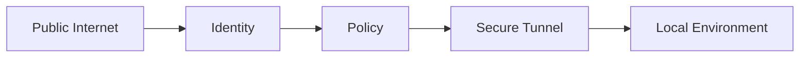

Eskiden VPN, reverse proxy, firewall, TLS ve authentication olarak ayrı ayrı ele alınabilecek problemler bu yapıda tek bir akış altında çözülebiliyor. Üstelik çoğu senaryo için birkaç dashboard ayarı ve tek bir connector yeterli oluyor.
