# Projeler İçin Ortak Developer ve AI Dokümantasyonu

AI coding agent’ları artık yalnızca kod üreten yardımcı araçlar değil. Codex, Claude Code, OpenCode ve benzeri araçlar repository içinde arama yapabiliyor, dosyaları okuyabiliyor, test çalıştırabiliyor, hata ayıklayabiliyor ve verilen görevleri büyük ölçüde bağımsız şekilde tamamlayabiliyor.

Bu değişim proje dokümantasyonunun rolünü de değiştiriyor.

Eskiden dokümantasyonun ana hedef kitlesi insanlardı. README dosyaları, katkı rehberleri, mimari açıklamalar ve geliştirme prosedürleri yeni developer’ların projeyi anlamasını kolaylaştırıyordu.

Bugün aynı bilgiye AI agent’larının da ihtiyacı var.

Buradaki temel soru şu:

> İnsanlar için ayrı, AI agent’ları için ayrı dokümantasyon mu hazırlamalıyız; yoksa her ikisinin de kullanabileceği ortak bir proje bilgi yapısı mı kurmalıyız?

Özellikle açık kaynak projelerde ikinci yaklaşım çok daha sürdürülebilir görünüyor.

---

## 1. Agent’ın Asıl İhtiyacı Kod Değil, Proje Bağlamı

Bir coding agent’a şu görevi vermek kolaydır:

```text
Payment refund endpoint'ini ekle.
```

Agent repository’yi inceleyebilir, benzer endpoint’leri bulabilir ve çalışan bir implementation üretebilir.

Ancak source code her şeyi anlatmaz.

Agent’ın şu soruların cevaplarına da ihtiyacı vardır:

- Projenin mimarisi nasıl?
- Business logic hangi katmanda bulunmalı?
- Validation nasıl yapılmalı?
- Error handling standardı nedir?
- Test stratejisi nasıl?
- Yeni dependency ne zaman eklenebilir?
- Database migration prosedürü nedir?
- Hangi mimari kararlar daha önce alındı?
- Hangi yaklaşımlar özellikle tercih edilmedi?

İnsan contributor da aynı bilgilere ihtiyaç duyar.

Bu nedenle insan ve AI’ın ihtiyaç duyduğu proje bilgisi aslında büyük ölçüde aynıdır.

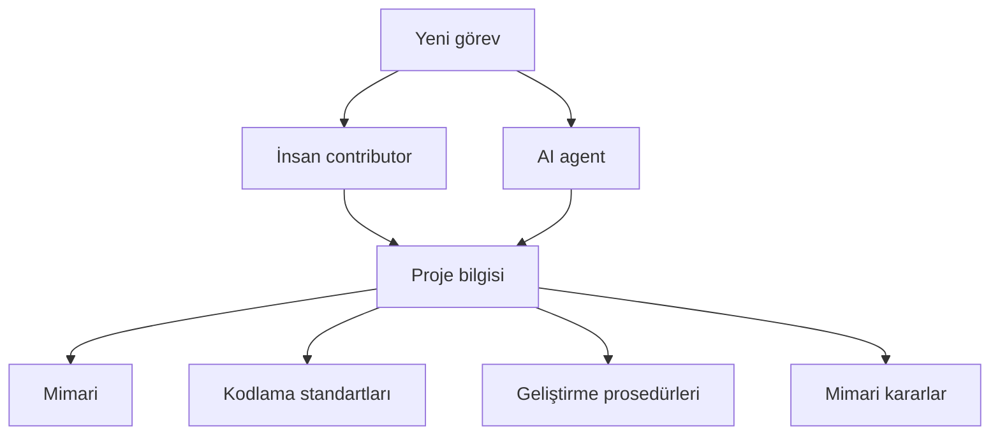

Sorun AI’ın kod yazamaması değil, **projenin kendi kurallarını ve geçmişini bilmemesi**.

---

## 2. AI İçin Ayrı Dokümantasyon Yazmak Yeni Bir Problem Yaratıyor

İlk akla gelen yaklaşım, AI’a özel bilgileri `.agents` gibi klasörlerde toplamaktır.

Örneğin:

```text
project/
├── docs/
│   └── database-migrations.md
├── .agents/
│   ├── rules/
│   │   └── database-migrations.md
│   └── skills/
│       └── migration/
│           └── SKILL.md
├── CONTRIBUTING.md
└── AGENTS.md
```

Buradaki problem aynı bilginin birkaç yerde tekrar edilmesidir.

Zamanla şu durum oluşabilir:

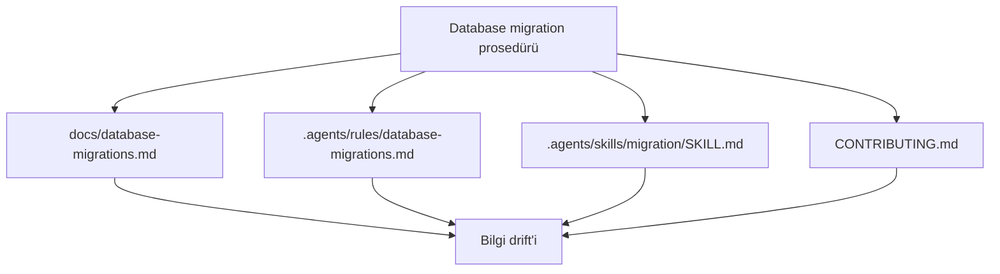

Bir dosya güncellenir, diğeri unutulur.

Sonrasında şu soru ortaya çıkar:

> Hangisi gerçek kaynak?

AI için ikinci bir dokümantasyon evreni oluşturmak yerine proje bilgisini tek yerde tutmak daha sağlıklıdır.

---

## 3. `docs/` Projenin Canonical Knowledge Base’i Olabilir

Daha temiz yaklaşım, repository içindeki `docs/` klasörünü projenin ana bilgi kaynağı olarak kullanmaktır.

Örneğin:

```text
project/
├── README.md
├── CONTRIBUTING.md
├── AGENTS.md
│
├── docs/
│   ├── index.md
│   ├── getting-started/
│   │   ├── installation.md
│   │   └── local-development.md
│   │
│   ├── architecture/
│   │   ├── overview.md
│   │   ├── frontend.md
│   │   ├── backend.md
│   │   └── data-flow.md
│   │
│   ├── contributing/
│   │   ├── overview.md
│   │   ├── coding-standards.md
│   │   ├── testing.md
│   │   ├── debugging.md
│   │   ├── commits.md
│   │   └── pull-requests.md
│   │
│   ├── development/
│   │   ├── adding-feature.md
│   │   ├── fixing-bugs.md
│   │   ├── database-migrations.md
│   │   └── dependency-upgrades.md
│   │
│   ├── adr/
│   ├── api/
│   ├── security/
│   └── operations/
│
├── .agents/
├── src/
└── tests/
```

Bu yapıda `docs/` yalnızca kullanıcı dokümantasyonu değildir.

Aynı zamanda:

- contributor rehberi,
- mimari referans,
- geliştirme prosedürü,
- karar arşivi,
- AI agent knowledge base’i

olarak çalışır.

---

## 4. Açık Kaynak Projelerde Bu Model Özellikle Güçlü

Open source projelerde proje bilgisinin yalnızca core maintainer’lar tarafından değil, dışarıdan katkı sağlayacak kişiler tarafından da tüketilmesi gerekir.

Yeni bir contributor genellikle şu soruların cevaplarını arar:

- Projeyi localde nasıl çalıştırırım?
- Kod yapısını nasıl öğrenirim?
- Yeni feature eklerken hangi kurallara uymalıyım?
- Testleri nasıl yazmalıyım?
- PR göndermeden önce hangi kontrolleri çalıştırmalıyım?
- Mimari değişikliklerde nasıl bir süreç izleniyor?

AI agent’ın ihtiyacı da neredeyse aynıdır.

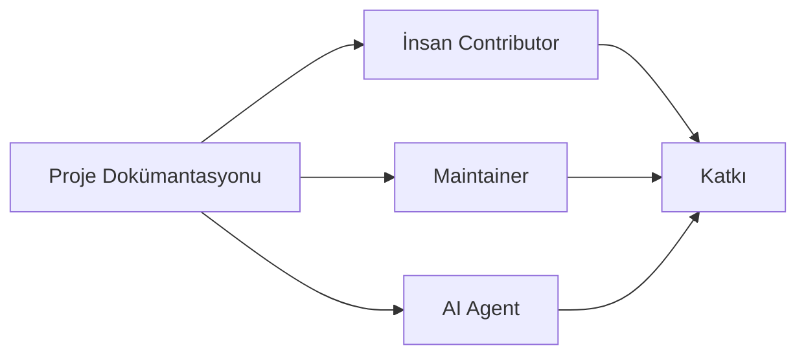

Dolayısıyla iyi bir contributor dokümantasyonu aynı zamanda iyi bir agent context’idir.

Örneğin `docs/development/database-migrations.md` şöyle olabilir:

```markdown
# Database Migrations

When changing the database schema:

1. Do not modify migrations already deployed to production.
2. Create a new migration.
3. Verify backward compatibility.
4. Review affected indexes.
5. Run migration tests.
6. Verify rollback behavior where applicable.
7. Update related documentation.
```

Aynı metni hem insan hem agent kullanabilir.

---

## 5. VitePress ile Aynı Dokümantasyonu Birden Fazla Yerde Kullanmak

Markdown tabanlı dokümantasyon sistemlerinin en büyük avantajlarından biri, aynı kaynak dosyalarının farklı tüketicilere sunulabilmesidir.

VitePress gibi bir sistem kullanıldığında:

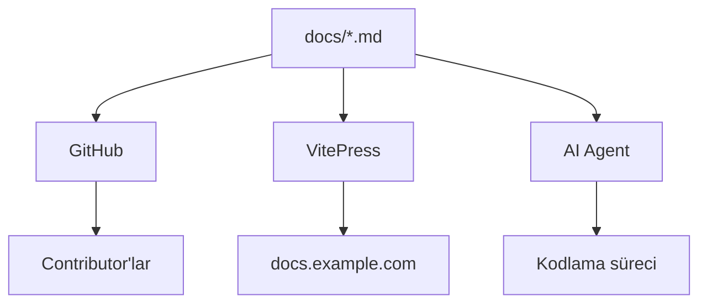

Aynı Markdown dosyaları:

- GitHub üzerinde okunabilir,
- VitePress ile dokümantasyon sitesine dönüşebilir,
- agent tarafından repository içinden doğrudan okunabilir.

Bu, dokümantasyonu gerçek anlamda **single source of truth** haline getirir.

---

## 6. Dokümantasyonu Aynı Zamanda MCP Sunucusu Olarak Sunmak

Dokümantasyon iyi yapılandırıldığında bir başka önemli avantaj ortaya çıkar: aynı içerik yalnızca web sitesi veya repository içindeki Markdown dosyaları olarak değil, **remote bir MCP sunucusu üzerinden de yayınlanabilir**.

Bu özellikle open source projeler için oldukça güçlü bir modeldir.

Dokümantasyon zaten:

- Markdown tabanlı,
- kategorize edilmiş,
- başlıklarla ayrılmış,
- metadata içeren,
- canonical kaynaklardan oluşan

bir yapıya sahipse MCP tarafında tekrar ayrı bir knowledge base hazırlamaya gerek kalmaz.

Aynı `docs/` ağacı doğrudan MCP tarafından okunabilir.

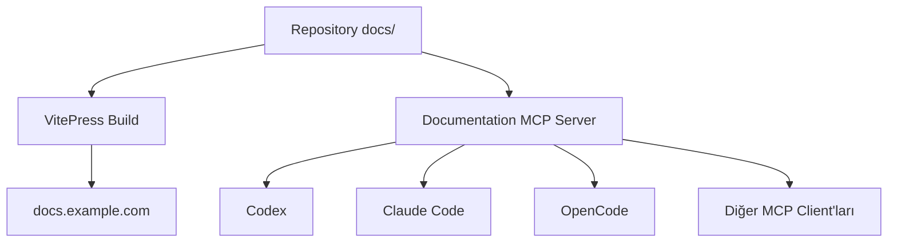

Bu durumda projenin dokümantasyonu iki farklı interface üzerinden sunulur:

```text
Humans
→ https://docs.example.com

Agents
→ https://mcp.example.com
```

Ancak arkadaki bilgi aynıdır.

Bu önemli çünkü MCP için ayrı içerik üretmek yerine mevcut dokümantasyon **machine-accessible interface** kazanmış olur.

---

## 7. Remote Documentation MCP Neden Faydalı?

Local repository içerisindeki dokümantasyonu agent zaten okuyabilir.

Fakat remote MCP özellikle repository henüz localde bulunmadığında veya agent’ın başka bir proje bağlamından bilgiye erişmesi gerektiğinde önem kazanır.

Örneğin bir contributor kendi projesinde bir açık kaynak kütüphaneyi kullanıyor olabilir:

```text
my-project/
└── package.json
```

Kütüphanenin repository’sini clone etmemiş olabilir.

Ancak agent:

```text
"Bu kütüphanede custom adapter nasıl yazılıyor?"
```

sorusunda projenin public MCP sunucusuna bağlanabilir.

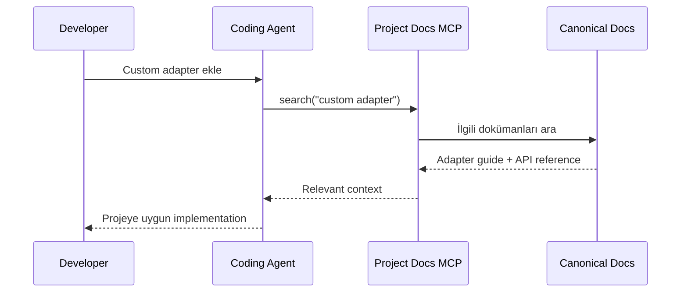

Bu modelde contributor’ın:

- repository’yi clone etmesi,
- doküman klasörünü bulması,
- hangi sayfanın doğru olduğunu anlaması

gerekmeyebilir.

Agent gerekli bilgiyi doğrudan projenin resmi documentation MCP’sinden alabilir.

---

## 8. Maintainer’lar İçin de Kullanışlı

Remote documentation MCP yalnızca dış contributor’lara yardımcı olmaz.

Maintainer’lar açısından da faydalıdır.

Bir maintainer aynı anda farklı repository’lerde çalışıyor olabilir.

Örneğin:

```text
frontend/
backend/
sdk/
cli/
docs/
```

Her repository’deki agent bütün diğer repository’leri local olarak göremeyebilir.

Buna rağmen merkezi bir MCP sunucusu sayesinde şirket veya proje genelindeki bilgiye erişebilir.

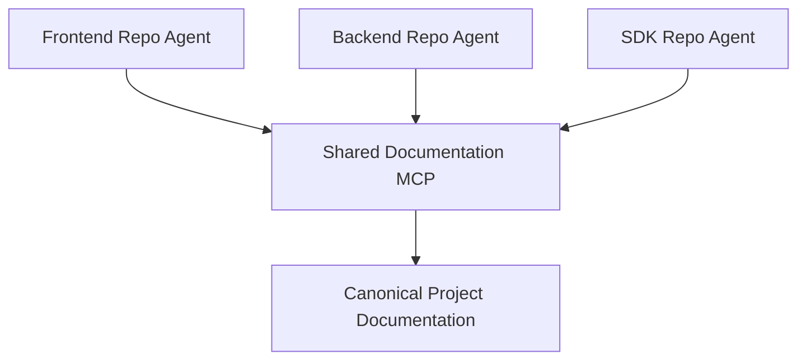

Bu özellikle monorepo kullanılmayan büyük projelerde anlamlıdır.

---

## 9. MCP Sunucusu Hangi Araçları Sağlayabilir?

Basit bir documentation MCP sunucusu birkaç temel capability ile başlayabilir.

Örneğin:

```text
search_docs(query)
get_document(path)
list_sections()
list_documents(category)
get_related_documents(path)
```

Daha gelişmiş durumda:

```text
search_architecture(query)
search_adrs(query)
search_contributing_guides(query)
search_api_docs(query)
```

gibi domain-specific araçlar da sunulabilir.

Ancak mümkün olduğunca MCP interface’i dokümantasyon yapısını birebir tekrar etmek yerine basit tutulmalıdır.

Örneğin:

```text
search_docs({
  query: "database migration rollback",
  category: "development",
  status: "canonical"
})
```

yeterli olabilir.

Sonuç:

```json
{
  "results": [
    {
      "title": "Database Migrations",
      "path": "development/database-migrations.md",
      "section": "Rollback",
      "status": "canonical"
    }
  ]
}
```

Agent ardından gerekli bölümü okuyabilir.

---

## 10. Structured Documentation MCP İçin Büyük Avantaj Sağlar

Dokümanlara metadata eklemek burada daha da önemli hale gelir.

Örneğin:

```yaml
---
title: Database Migrations
description: Procedure for creating and reviewing database migrations.
category: development
status: canonical
owner: backend-team
last-reviewed: 2026-08-01
audience:
  - contributor
  - maintainer
  - agent
---
```

MCP server bu metadata’yı index oluştururken kullanabilir.

Örneğin agent:

```text
search_docs(
  query = "database schema changes",
  status = "canonical"
)
```

dediğinde deprecated veya draft dokümanlar otomatik olarak daha düşük önceliğe alınabilir.

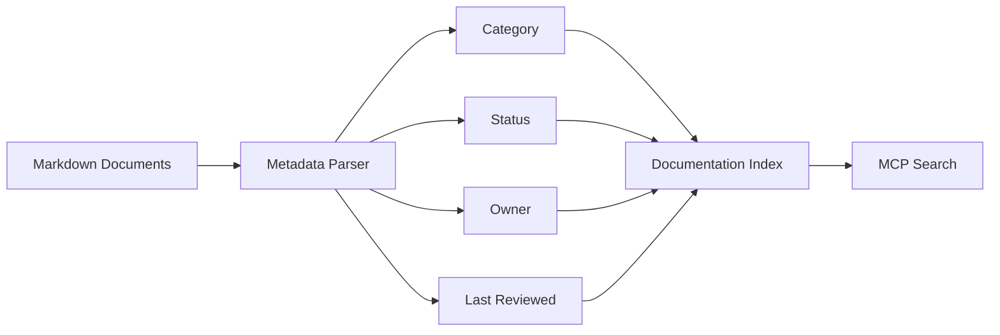

Bu nedenle insan dostu dokümantasyon yapısı aynı zamanda iyi bir MCP data modeline dönüşür.

---

## 11. MCP İçin Semantic Search Şart mı?

Hayır.

Dokümantasyon düzgün yapılandırılmışsa remote MCP ilk etapta oldukça basit çalışabilir:

```text
Markdown
+
metadata
+
full-text search
```

Örneğin:

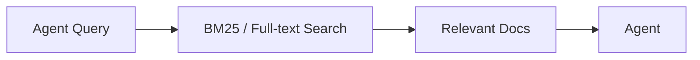

Modern agent sonuçları okuyup gerekirse yeni aramalar yapabilir.

Dokümantasyon çok büyüdüğünde semantic search eklenebilir:

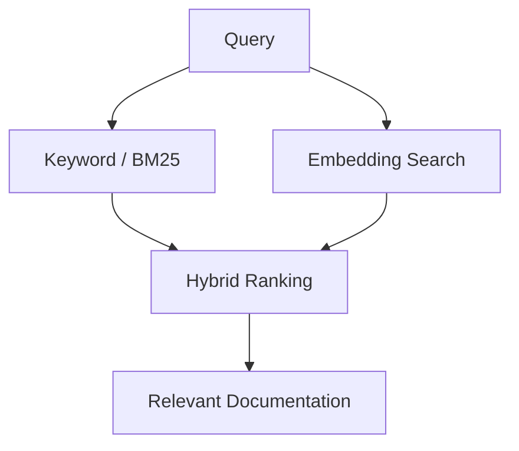

Bu nedenle documentation MCP tasarlanırken semantic search zorunlu dependency olarak görülmek zorunda değildir.

Önce basit full-text retrieval ile başlanıp ihtiyaç arttığında hybrid search’e geçilebilir.

---

## 12. Resmi Documentation MCP Güvenilir Kaynak Problemini de Çözebilir

AI agent’larının açık kaynak projelerdeki bir diğer problemi hangi bilginin resmi olduğunu anlamaktır.

Agent internette arama yaptığında:

- eski blog postları,
- Stack Overflow cevapları,
- eski GitHub issue’ları,
- üçüncü taraf tutorial’ları,
- deprecated documentation

bulabilir.

Projenin resmi MCP endpoint’i olduğunda agent’a doğrudan:

```text
Official documentation source:
https://mcp.example.com
```

verilebilir.

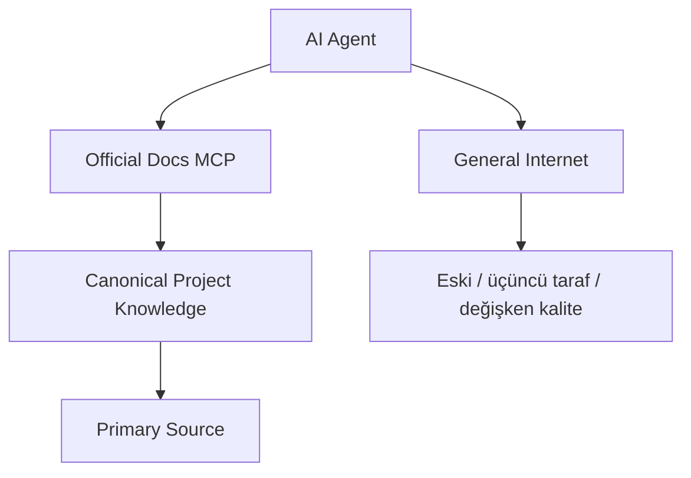

Böylece projenin kendi dokümantasyonu AI açısından da primary source haline gelir.

Bu özellikle hızlı değişen framework, SDK ve API projelerinde önemli olabilir.

---

## 13. `README.md`, `CONTRIBUTING.md` ve `AGENTS.md` Ana Bilgi Kaynağı Değil, Router Olmalı

Bütün proje bilgisini birkaç dev dosyanın içine doldurmak yerine bunları giriş noktası olarak kullanmak daha temizdir.

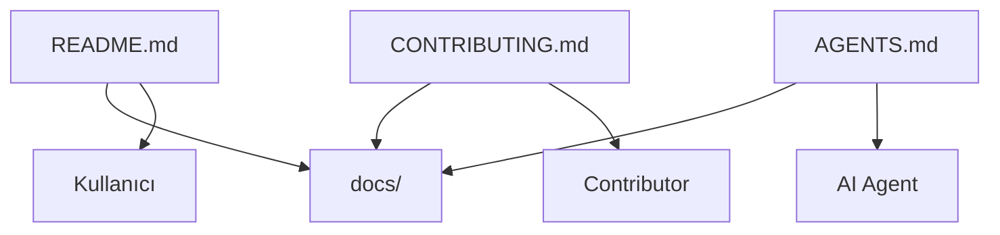

Rol dağılımı şöyle olabilir:

```text
README.md
→ Projeyi tanıtır.

CONTRIBUTING.md
→ İnsan contributor'ı yönlendirir.

AGENTS.md
→ AI agent'ı yönlendirir.

docs/
→ Gerçek proje bilgisini tutar.
```

`AGENTS.md` ayrıca remote MCP’yi de gösterebilir:

```markdown
# Agent Instructions

Project documentation is the canonical source of truth.

Local documentation:

- `docs/index.md`

Remote documentation MCP:

- `https://mcp.example.com`

When the repository documentation is available locally, prefer local files.
Use the documentation MCP for cross-project or remote documentation lookup.

If implementation and documentation disagree, report the inconsistency.
```

Bu yaklaşım local ve remote retrieval arasında oldukça temiz bir ayrım sağlar.

---

## 14. Dokümantasyonu WHAT, WHY ve HOW Olarak Ayırmak

Dokümantasyonun hem insanlar hem agent’lar tarafından rahat tüketilebilmesi için bilgi yapısının açık olması gerekir.

Bunu üç temel kategoriye ayırmak oldukça kullanışlıdır.

### WHAT — Sistem nasıl çalışıyor?

```text
docs/architecture/
docs/api/
docs/domain/
```

### WHY — Neden böyle yapıldı?

```text
docs/adr/
```

### HOW — Bu projede bir iş nasıl yapılmalı?

```text
docs/development/
docs/contributing/
```

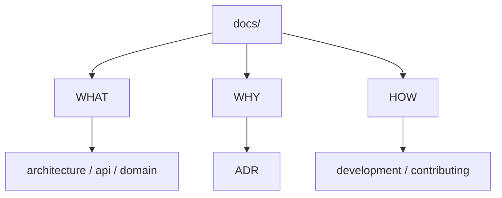

Aynı yapı MCP tarafında da doğal olarak kullanılabilir.

Örneğin agent:

```text
"Bu projede transaction neden application layer'da yönetiliyor?"
```

diye sorduğunda retrieval:

```text
architecture/
+
adr/
```

alanlarını önceleyebilir.

---

## 15. `.agents` Klasörü Yine de Gerekli Olabilir

Bu yaklaşım `.agents` klasörünü tamamen gereksiz hale getirmez.

Ancak rolünü ciddi şekilde daraltır.

```text
docs/
→ İnsanların da bilmesi gereken proje bilgisi

.agents/
→ Yalnızca agent runtime/tooling'e özgü şeyler
```

Örneğin:

```text
.agents/
├── skills/
│   └── repository-context-builder/
├── scripts/
│   └── collect-diagnostics.ps1
└── automation/
```

mantıklıdır.

Ancak:

```text
.agents/rules/testing.md
```

yerine:

```text
docs/contributing/testing.md
```

daha doğru olur.

---

## 16. Şirketlerde Aynı Yaklaşım Nasıl Kullanılabilir?

Bu model şirket seviyesinde daha da güçlü hale gelir.

Her repository kendi proje bilgisini barındırabilir:

```text
payment-service/
└── docs/

notification-service/
└── docs/

frontend/
└── docs/
```

Bunun üzerinde şirket genelindeki engineering bilgileri için ortak bir katman bulunabilir:

```text
Company Engineering Knowledge/
├── architecture/
├── engineering-standards/
├── security/
├── infrastructure/
├── patterns/
├── adr/
└── lessons-learned/
```

Ve bu şirket knowledge base’i de remote MCP olarak sunulabilir.

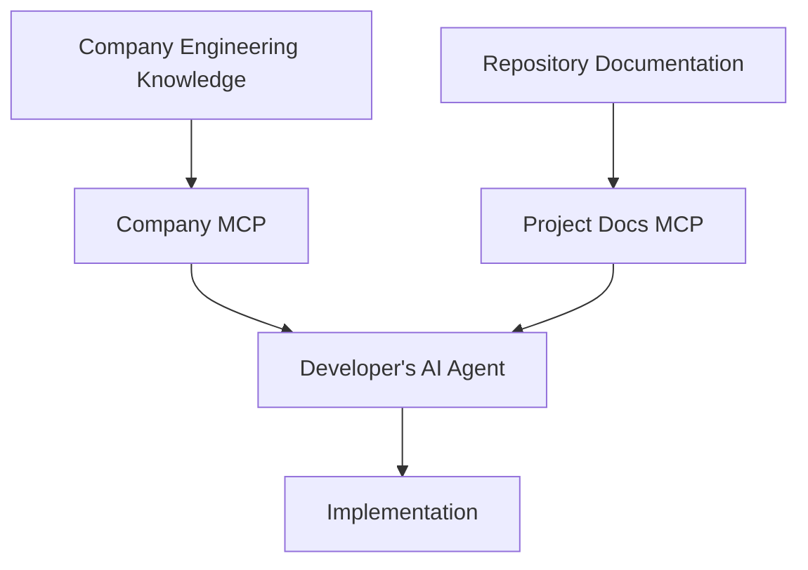

Agent iki farklı bilgi scope’una erişir:

```text
Company MCP
→ Şirket genelindeki standartlar

Project MCP
→ Repository-specific bilgi
```

Örneğin:

```text
Company:
- Logging standardı
- Security policy
- API conventions
- Observability standardı

Project:
- Payment domain modeli
- Repository architecture
- Project-specific ADR'ler
- Migration prosedürleri
```

Bu ayrım büyük organizasyonlarda oldukça değerlidir.

---

## 17. Developer Hangi AI Aracını Kullanırsa Kullansın Aynı Bilgiye Erişebilir

Şirket içinde developer’lar farklı araçlar kullanabilir:

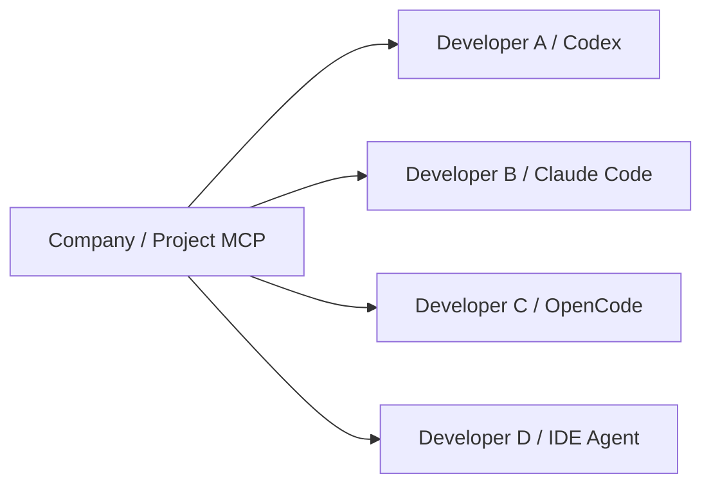

Bilgi agent’ın kendi memory sistemine veya vendor-specific configuration’a bağlı kalmaz.

Bu da şirket açısından önemli bir avantaj yaratır:

> AI tooling değişebilir, şirket bilgisi aynı kalır.

Bir ekip bugün Codex kullanıp daha sonra başka bir agent’a geçebilir.

Dokümantasyon ve MCP katmanı yeniden yazılmak zorunda değildir.

---

## 18. Ortak Dokümantasyon Kod Kalitesini Nasıl Etkileyebilir?

Ortak knowledge layer olmadan her agent kendi genel model bilgisini kullanır.

Bir agent repository pattern ekleyebilir.

Diğeri doğrudan DbContext kullanabilir.

Bir başkası farklı error handling yaklaşımı seçebilir.

Ortak dokümantasyon kullanıldığında agent’ın çözüm alanı daralır.

Örneğin:

```text
- Controllers must not contain business logic.
- Validation uses FluentValidation.
- API errors use Problem Details.
- Integration tests are required for new endpoints.
- PII must not be logged.
- Repository abstraction is not used in this project.
```

Agent artık:

> Bu problem genel olarak nasıl çözülür?

yerine:

> Bu projede bu problem nasıl çözülür?

sorusuna göre hareket eder.

---

## 19. Senior Developer Bilgisini Organizasyon Hafızasına Dönüştürmek

Şirketlerde teknik bilginin önemli bir bölümü dokümante edilmemiş durumdadır.

Örneğin bir senior developer PR review sırasında şöyle bir yorum bırakabilir:

```text
Burada repository abstraction oluşturma.
Bu serviste EF Core DbContext doğrudan kullanılıyor.
```

Daha gelişmiş bir sistem bu feedback’i dokümantasyon adayına çevirebilir.

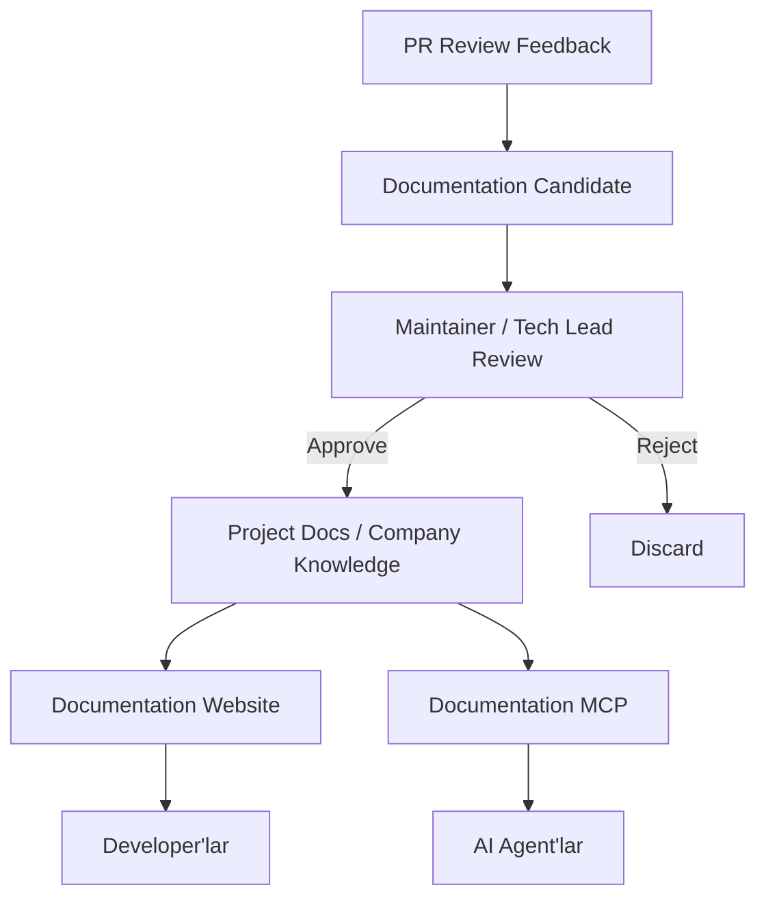

Buradaki önemli nokta dokümantasyon güncellendiğinde hem insan hem AI tarafının aynı anda güncellenmesidir.

Ayrı bir AI knowledge base’i senkronize etmek gerekmez.

---

## 20. AI Dokümantasyon Drift’ini Tespit Etmek İçin de Kullanılabilir

Agent yalnızca dokümantasyonu tüketmek zorunda değildir.

Dokümantasyon ile implementation arasındaki farkları da tespit edebilir.

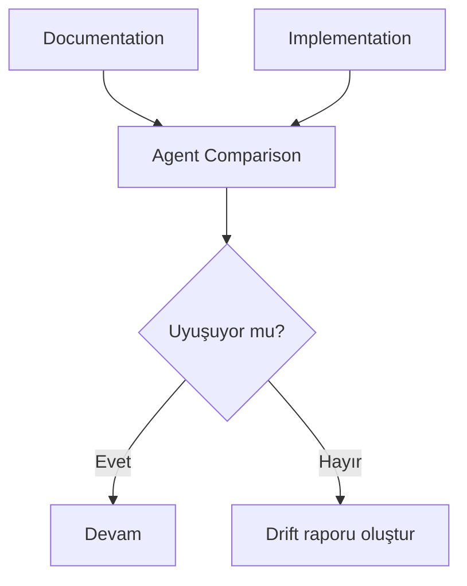

Bu sayede dokümantasyon geliştirme sürecinin aktif bir parçası haline gelir.

---

## 21. Bilgi Katmanı Tek Başına Yeterli Değil

Dokümantasyon agent’a nasıl davranması gerektiğini anlatır.

Ancak bunu gerçekten uyguladığını garanti etmez.

Bu nedenle deterministic kontroller gerekir.

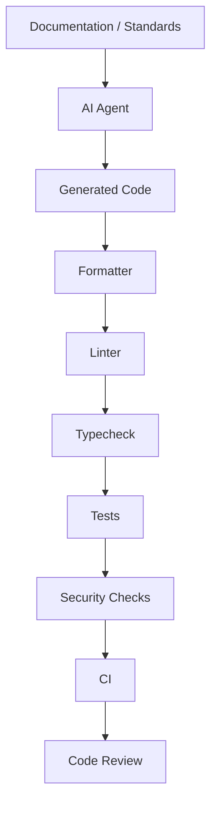

Dokümantasyon:

> Nasıl yapılmalı?

sorusuna cevap verir.

CI:

> Gerçekten öyle yapılmış mı?

sorusuna cevap verir.

---

## 22. Önerilen Açık Kaynak Repository Yapısı

Sonuç olarak açık kaynak bir proje için şu yapı oldukça temiz olabilir:

```text
project/
├── README.md
├── CONTRIBUTING.md
├── AGENTS.md
│
├── docs/
│   ├── .vitepress/
│   ├── index.md
│   ├── getting-started/
│   ├── architecture/
│   ├── contributing/
│   ├── development/
│   ├── adr/
│   ├── api/
│   ├── security/
│   └── operations/
│
├── .agents/
│   ├── skills/
│   └── scripts/
│
├── src/
└── tests/
```

Aynı `docs/` klasörü üç farklı interface oluşturabilir:

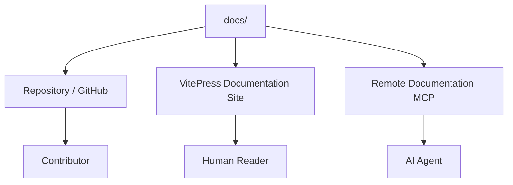

Görev dağılımı:

| Kaynak            | Rol                                         |
| ----------------- | ------------------------------------------- |
| `README.md`       | Projeyi tanıtır                             |
| `CONTRIBUTING.md` | İnsan contributor için giriş noktası        |
| `AGENTS.md`       | AI agent için giriş noktası                 |
| `docs/`           | Canonical proje bilgisi                     |
| VitePress         | Dokümantasyonu insanlar için yayınlar       |
| Documentation MCP | Aynı bilgiyi agent’lara remote olarak sunar |
| `.agents/`        | Sadece agent-specific tooling               |
| `src/`            | Implementation                              |
| `tests/`          | Davranış doğrulaması                        |

---

## 23. Şirket Seviyesinde Nihai Mimari

Şirket tarafında yapı biraz daha genişleyebilir:

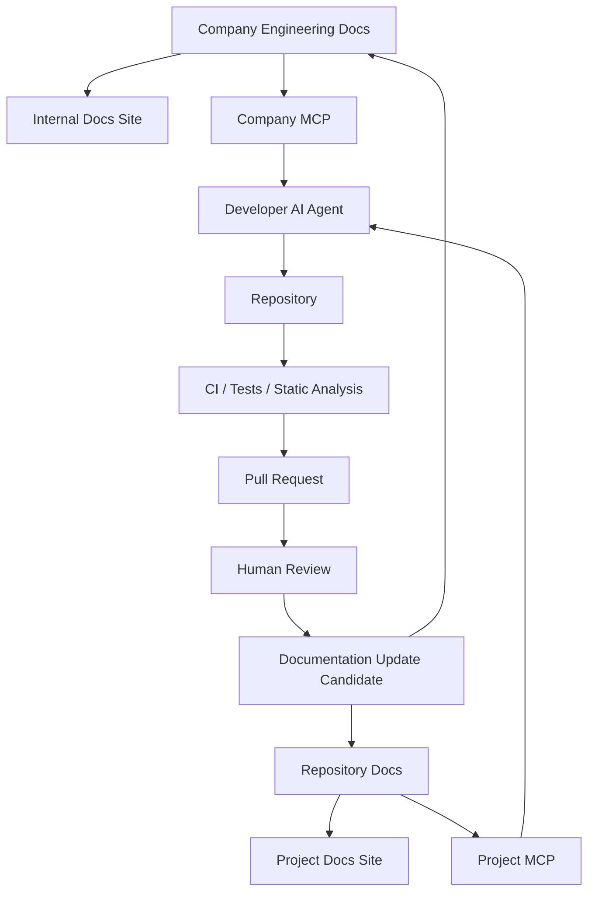

Bu yapıda dokümantasyon yalnızca bilgi saklayan bir sistem değildir.

Aynı zamanda:

- insan arayüzü,
- agent retrieval katmanı,
- organizational memory,
- development standardı,
- AI context provider

haline gelir.

---

## Sonuç

AI coding agent’larının yaygınlaşmasıyla birlikte proje dokümantasyonunun hedef kitlesi değişiyor.

Artık iyi bir dokümantasyon yalnızca şu soruya cevap vermemeli:

> Yeni bir developer projeyi nasıl öğrenir?

Aynı zamanda şu soruya da cevap vermeli:

> Bir AI agent bu projede doğru karar verebilmek için ihtiyaç duyduğu bağlamı nasıl edinir?

Bunun çözümü AI için ayrı bir dokümantasyon sistemi oluşturmak olmak zorunda değil.

Daha sürdürülebilir yaklaşım, insanlarla agent’ların aynı canonical bilgi kaynağını kullanmasıdır.

```mermaid
flowchart TD
    Docs["Canonical Project Documentation"]

    Docs --> Website["Documentation Website"]
    Docs --> Repo["Repository"]
    Docs --> MCP["Documentation MCP"]

    Website --> Humans["Humans"]
    Repo --> Contributors["Contributors"]
    MCP --> Agents["AI Agents"]

    Humans --> Shared["Aynı bilgi"]
    Contributors --> Shared
    Agents --> Shared

    Shared --> Consistency["Daha tutarlı geliştirme"]
```

Özellikle açık kaynak projelerde bu yaklaşım güçlüdür.

Bir proje dokümantasyonunu iyi yapılandırdığında yalnızca güzel bir VitePress sitesi elde etmiş olmazsın. Aynı içerik aynı zamanda projenin resmi **AI-readable knowledge interface’i** haline gelebilir.

Örneğin:

```text
https://docs.example.com
→ Humans

https://mcp.example.com
→ AI Agents
```

İkisi de aynı Markdown kaynaklarından beslenir.

Şirketlerde ise bunun üzerine ortak engineering documentation ve company-level MCP eklenebilir.

Böylece developer hangi AI aracını kullanırsa kullansın aynı şirket standartlarına, aynı mimari kararlara ve aynı proje bilgisine erişebilir.

Asıl değer burada ortaya çıkar:

**Dokümantasyon artık sadece okunacak bir site değil; insanlar ve AI agent’ları için ortak, version-controlled, erişilebilir ve yeniden kullanılabilir bir proje bilgi altyapısına dönüşür.**
